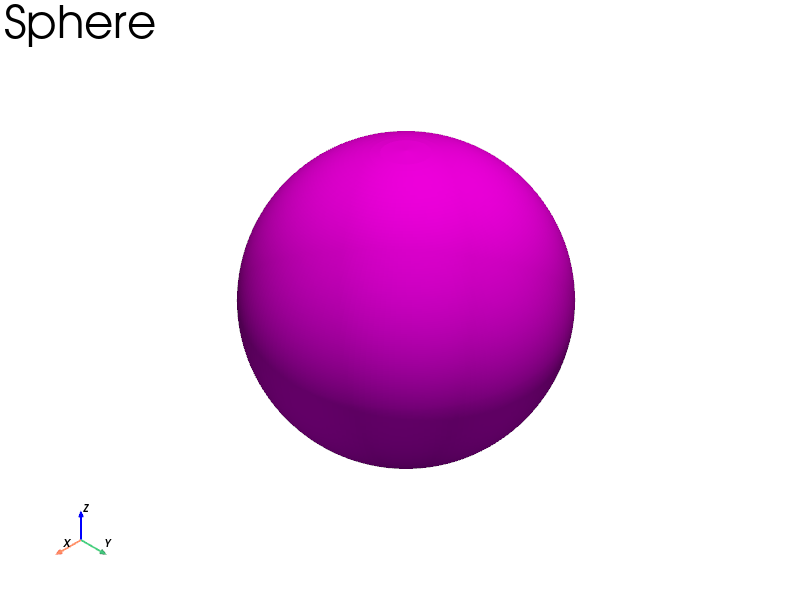
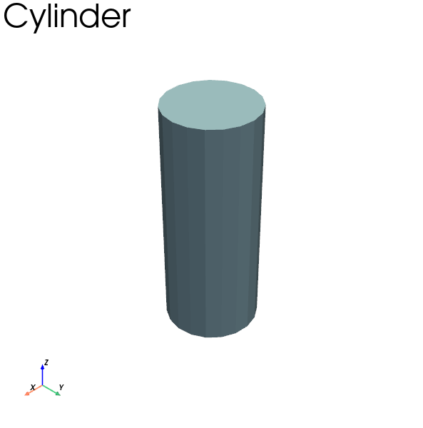

# PISTL (pronounced as "Pistol")

[](https://badge.fury.io/py/pistl)
[](https://pepy.tech/project/pistl)
[](https://pepy.tech/project/pistl)
[](https://pepy.tech/project/pistl)


**About the figure above**: Multiple shapes generated using PISTL as STL file and visualized in **Meshmixer** for the purpose of this picture. The visualization in PISTL can be done using pyvista, which is installed as a dependency.

## What is PISTL?

PISTL is a library that can be used in python to programatically create stereolithographic (stl) files of regular geometric shapes like circle, cylinder, tetrahedron, sphere, pyramid and others by morphing these shapes. pystl also provide functions that can be used to translate and rotate these stl objects.

In summary:
PISTL can be used for the following purposes:

- to create simple geometric shape files in .stl format.
- visualize this stl files. [PySTL uses pyvista for such visualizations].
- perform simple transformations like translate, rotate and scale shapes.

### Examples - 1

```python
# This example creates a sphere stl using pistl

# step 1.0: import PySTL
import pistl
from pistl import shapes

#instantiate a sphere shape
sphere = shapes.Sphere()

# set the radius of the sphere
sphere.radius = 10

# set resolution of the sphere in longitude and latitude
sphere.resolution_latitude = 200
sphere.resoultion_longitude = 200

# once you have set the radius and resolution, call create method
sphere.create()

# call export method to set stl filename and shape name
sphere.export('Results/sphere.stl', 'sphere')

# Finally visualize the shape in trame window or in a jupyter kernal using the visualize method.
sphere.visualize().plot(color='magenta', text=f'{sphere.name}')
```



### Examples - 2

```python
# cylinder
# step 1.0: create a cylinder object
cyl = shapes.Cylinder()
# step 2.0: Set appropriate properties on the object
cyl._height = 10.00
cyl._top_circle_radius = 4.00
cyl._base_circle_radius = 4.00
cyl.resolution = 20
cyl.close = True
# step 3.0: call create method on the object
cyl.create()
# step 4.0: call export method to write the stl file
cyl.export('Results/cyl.stl', 'cyl')
# step 5.0 Call the visualize method to plot using pyvista
cyl.visualize().plot(text=f'{cyl.name}')
```



**PISTL is an open source project that welcomes contributions from developers from diverse community and backgrounds.**
